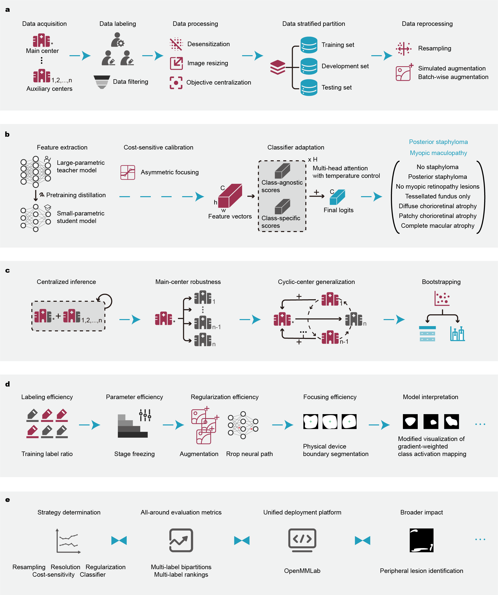

# [[npj Digital Medicine'25](https://doi.org/10.1038/s41746-025-01849-y)] Diagnosing pathologic myopia by identifying morphologic patterns using ultra widefield images with deep learning

Pathologic myopia is a leading cause of visual impairment and blindness. While deep learning-based approaches aid in recognizing pathologic myopia using color fundus photography, they often rely on implicit patterns that lack clinical interpretability. This study aims to diagnose pathologic myopia by identifying clinically significant morphologic patterns, specifically posterior staphyloma and myopic maculopathy, by leveraging ultra-widefield (UWF) images that provide a broad retinal field of view. We curate a large-scale, multi-source UWF myopia dataset called PSMM and introduce RealMNet, an end-to-end lightweight framework designed to identify these challenging patterns. Benefiting from the fast pretraining distillation backbone, RealMNet comprises only 21 million parameters, which facilitates deployment for medical devices. Extensive experiments conducted across three different protocols demonstrate the robustness and generalizability of RealMNet. RealMNet achieves an F1 Score of 0.7970 (95% CI 0.7612–0.8328), mAP of 0.8497 (95% CI 0.8058–0.8937), and AUROC of 0.9745 (95% CI 0.9690–0.9801), showcasing promise in clinical applications.



## News

[2025/7] The training and inference code is released.

[2025/7] The paper is published in [npj Digital Medicine](https://doi.org/10.1038/s41746-025-01849-y) (IF=15.1).

## Environment

Create the environment with conda:

```shell
cd WORK_DIR/
conda create -n RealMNet python=3.10 -y
conda activate RealMNet
```

Install PyTorch with the tested version 1.13.0:

```shell
conda install pytorch==1.13.0 torchvision==0.14.0 torchaudio==0.13.0 pytorch-cuda=11.7 -c pytorch -c nvidia
```

Build customized mmengine with the tested version 0.8.4:

```shell
mmenginecd mmengine
pip install -e . -v
```

Build mmcv with the tested version 2.0.1:

```shell
cd mmcv
pip install -r requirements/optional.txt
nvcc --version
gcc --version
pip install -e . -v
```

Build customized mmpretrain with the tested version 1.0.2:

```shell
cd mmpretrain
pip install -r requirements.txt
pip install -v -e .
```

Verify the installation:

```shell
# verify the installation of PyTorch
python -c 'import torch;print(torch.__version__);print(torch.version.cuda)'
python -c 'import torch;print(torch.cuda.is_available())'
# verify the installation of mmengine
python -c 'from mmengine.utils.dl_utils import collect_env;print(collect_env())'
python -c 'import mmengine;print(mmengine.__version__)'
# verify the installation of mmcv
python .dev_scripts/check_installation.py
```

## Dataset

The PSMM dataset is made public both on this repository and [Hugging Face](https://huggingface.co/datasets/yo3nglau/PSMM). The preprocessed UWF images with a resolution of 384 are released.

## Training

```shell
tools/dist_train.sh configs/myopia_models/tinyvit-21m-distill-384_MYOPIA.py 4
```

## Inference

```shell
export run_dir=work_dirs/tinyvit-21m-distill-384_MYOPIA; \
export run_time=RUN_TIME_PLACEHOLDER; \
export epoch=50; \
export out_item=metrics; \
tools/dist_test.sh \
$run_dir/$run_time/vis_data/config.py \
$run_dir/$run_time/epoch_$epoch.pth \
4 \
--out $run_dir/$run_time/vis_data/test.json \
--out-item $out_item
```

## Citation

If you find this repository useful, please consider citing this paper:

```
TBD
```

## Acknowledgement

This work is built on [OpenMMLab](https://github.com/open-mmlab).
